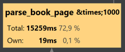
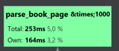
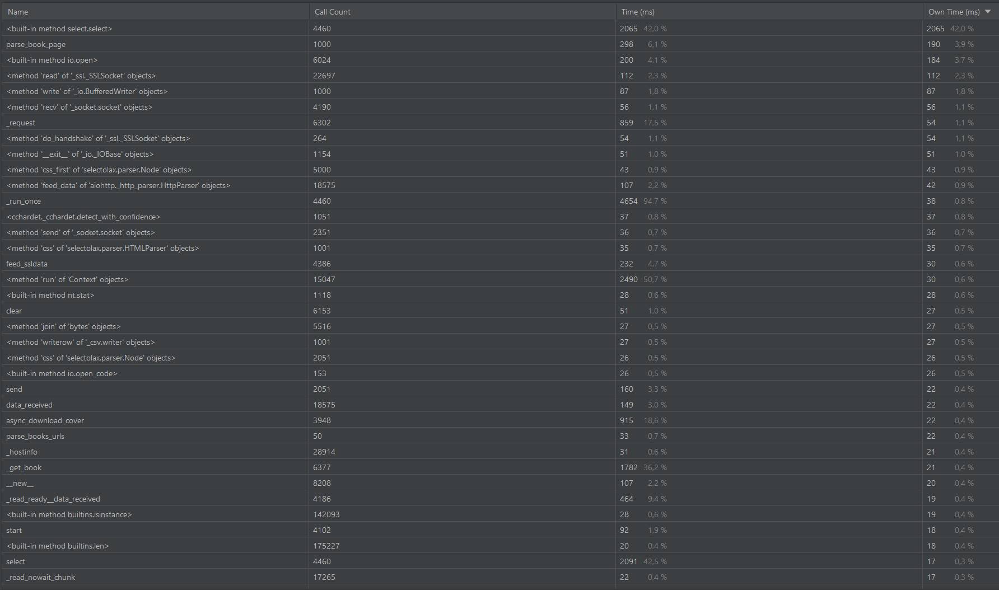
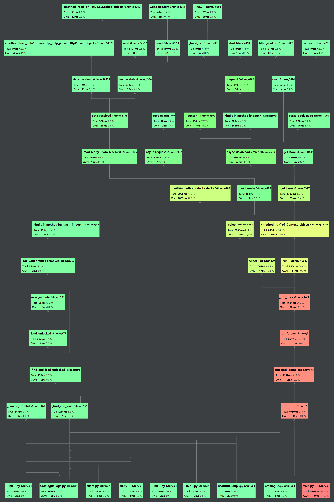
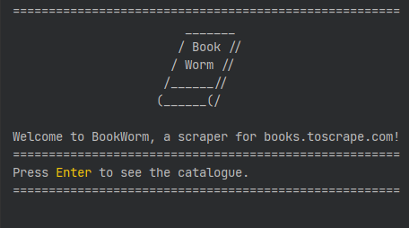
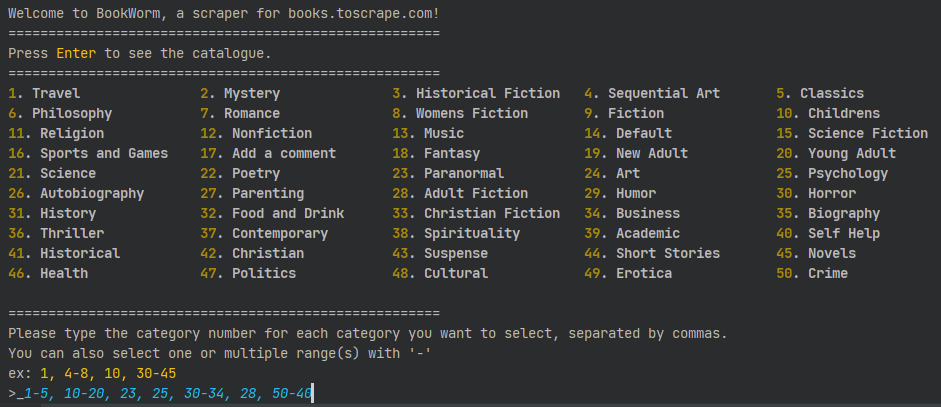
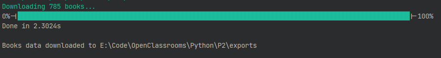

## OpenClassrooms - Python Developer certification program   
### Project #2 : build a web scraper

___
# <a id='top'>Summary</a>

1. [Project goals](#1)  
2. [Requirements](#2)  
3. [Solving approach](#3)  
... 3.1 [First case: selected categories](#3_1)  
... 3.2 [Second case: all categories](#3_2)  
... 3.3 [Common steps](#3_3)  
4. [Implementation](#4)  
... 4.1 [First iteration: requests / BS4](#4_1)  
... 4.2 [Second iteration: requests / BS4 / multiprocessing](#4_2)  
... 4.3 [Third iteration: asyncio / Selectolax](#4_3)  
...... 4.3.a [I/O bound optimizations](#4_3_a)  
...... 4.3.b [CPU bound optimizations](#4_3_b)  
...... 4.3.c [Profiling](#4_3_c)  
5. [Exceptions](#5)  
6. [User Interface](#6)  

___

# <a id="1">1 - Project goals</a>

- Write a first application in Python
- Learn about HTTP requests and scraping 
- Learn how to use a package to parse HTML
- Learn how to interact with the OS (opening/writing files)

___ 
# <a id="2">2 - Requirements</a>

1. Scrape https://books.toscrape.com/ to get books categories
2. Ask the user which categories to extract
3. Scrape all books pages from selected categories and extract:
URL, UPC code, Title, Price including Tax, Price excluding Tax, Available stock, Description, Category name, Rating, Cover URL, Cover name
4. Export all books details to a local CSV file
5. Download books covers into folders (1 folder per category)
___
# <a id='3'>3 - Solving approach</a>

**Initial statements**

Manually browsing https://books.toscrape.com/ allows to make a few statements:

- From the landing page we can see that there is a **total of 1000 books**, divided in **50 categories**.  
- Each catalogue page displays a maximum of **20 books**.

There are 2 ways to access the books:

1. By accessing the URL of a category (ie: https://books.toscrape.com/catalogue/category/books/fiction_10/index.html)
2. By clicking the "**Next**" button at the bottom of each page:   


**Use cases**

1. The user only wants one or a few categories
2. The user wants all the catalogue

## <a id='3_1'>3.1 - Solution to the first case : _selected categories only_</a>

- Request the landing page content
- Parse the content to get the links of the first page of each category (50 pages max) 
- Display the categories
- Prompt the user to select desired categories to download
- Request the first page of each selected category
- Parse the content to get the number of books in that category
- Generate the URLS for each catalogue page of that category
- Append these URLS to a list

**example for category with books < 20 :**  
[Books to Scrape/Science Fiction](https://books.toscrape.com/catalogue/category/books/science-fiction_16/index.html) shows a total of 16 books.  
Since the pagination is set to display 20 books per page max, all the category's books are here.

**example for category with books > 20 :**  
[Books to Scrape/Fiction](https://books.toscrape.com/catalogue/category/books/fiction_10/index.html) category shows a total of 65 results.  
Again, since the pagination is set to 20 books/page we can use the `divmod()` function to define the number of URLS to generate.

```python
def get_pages_count():
    all_books_count = 65 # hardcoded for example
    page_books_count = 20 # hardcoded for example
    pages_count, rest = divmod(all_books_count, page_books_count)
    return pages_count if rest == 0 else pages_count + 1
# get_pages_count() returns 4 (20 books * 3 models + 5 books -> 1 additional page)
```
And take advantage of the constant URL structure to generate URLS like this:

```pre
https://books.toscrape.com/catalogue/category/books/fiction_10/page-1.html  
https://books.toscrape.com/catalogue/category/books/fiction_10/page-2.html  
...  
https://books.toscrape.com/catalogue/category/books/fiction_10/page-{pages_count | pages_count + 1}.html
```

## <a id='3_2'>3.2 - Solution to the second case : all catalogue</a>

The second method is similar to the first one, except we don't have to bother requesting the first page of each categories.

Since the whole catalogue has 1000 books, and displays 20 books/page, we know that there are 50 pages total.  
Therefore it's possible to generate 50 URLS following this pattern:

```pre
https://books.toscrape.com/catalogue/page-1.html   
https://books.toscrape.com/catalogue/page-2.html  
...
https://books.toscrape.com/catalogue/page-50.html
```

## <a id='3_3'>3.3 - Next common steps</a>

Once we have a list with all catalogue pages to scrape:
- Request and parse each catalogue page to get the URLS of the books
- Build a list with the URLS to each book
- Request and parse each book page
- Save each book details to a tuple

```python
Book = namedtuple(
    "Book",
    "url upc title itp etp stock description "
    "category rating cover_url cover_name",
)
```
- Request the book cover from the cover_url
- Create or access folder named from `category`
- Write the cover picture with `cover_name` as a name

Once every book has been built:
- Write a CSV file with the Book namedtuple keys as header
- Write 1 row per book with the book details  

[:arrow_up: Back to top](#top)
___
# <a id='4'>4 - Implementation</a>

## <a id='4_1'>4.1 - First iteration</a>

The first iteration of this project relied on the _**requests**_ and **_BeautifulSoup4_** Python packages.  
Running the script to scrape the entire catalogue took more than 18 minutes.


## <a id='4_2'>4.2 - Second iteration</a>

The second iteration used **multiprocessing** to run requests concurrently (and avoid the Global Interpreter Lock that throttles multithreading).  
This was a poor solution ; the time for the script to run was roughly divided by the number of CPU cores available.  
For example, with a 16 cores CPU, the execution time was approximately divided by 16, making the program run in more than 1 minute.


## <a id='4_3'>4.3 - Third iteration</a>

After profiling the application using cProfile, 2 factors were identified:

- The application is mainly I/O bound because it depends on HTTP requests
- It is also CPU bound during the phase of parsing the HTML content

### <a id='4_3_a'> 4.3.a Improvements made to the I/O bound part</a>

For a single request, it took ~1s to get the response content.  
In (smaller) use case #1 that would mean: 50 catalogue pages + 1000 book pages = 1050 pages to request.  
**This synchronous requests part of the program would take 1050s / 17.5 minutes to complete**  

This issue got solved by implementing **_asyncio_** and **_aiohttp_** packages to make asynchronous requests to the website.

In use case #1, the sequence would then be:

1. Request and parse the homepage content
2. Prompt for selected categories
2. **Async request the selected categories' homepages**
3. Build a list of book pages URLS
4. **Async requests the books pages URLS**

And in use case #2:
1. Request and parse the homepage content
2. **Async request the 50 generated URLS**
3. **Async request the 1000 books URLS**

### <a id='4_3_b'>4.3.b - Improvements to the CPU bound part</a>

In order to improve the parsing time, **_BeautifulSoup4_** has been replaced by **_Selectolax_**, a parser package based on **_Modest_** a C parser.  

  
**_cProfile call graph for BeautifulSoup4 parsing 1000 books_**  

  
**_cProfile call graph for Selectolax parsing 1000 books_**

On the same machine, this resulted in a ~15s improvement to run the whole use case #1.

### <a id='4_3_c'>4.3.c - Third iteration profiling</a>
~ 50% of the execution time spent between 2 functions:
- `<built-in method select.select>` : asyncio method to switch between coroutines ~2s : 42% of the execution time
- `parse_book_page` : parsing of the book pages with Selectolax ~0.3s: 6.1% of the execution time
- **Total execution time to download the whole catalogue: ~4.9ms**   
- **Time for downloading books and covers: ~2.6ms**  


**_cProfile statistics with asyncio / Selectolax_**


**_cProfile call graph with asyncio / Selectolax_**


[:arrow_up: Back to top](#top)
___
# <a id='5'>5 - Exceptions</a>

This project had two traps:

One book had single quotes in its description, resulting in a non formatted CSV line.  
A solution was to replace all single quotes by a valid character such as a blank space or an underscore.  

Two covers had the same file name, resulting in the second downloaded image to overwrite the first one.
To solve this case, a method to rename the file name in case of duplicate has been implemented:

For each file:
`next(incr_gen)` returns `""` and writes the file name as it is using the 'x' mode (eXclusive creation).  
If the file already exists, it raises a `FileExistsError` and the loops starts over, making the generator yield the next value `(1)` to append to the end of the file's name, and so on until `file_name(n).jpg` is available.

```python
    @staticmethod
    def incr_gen():
        first = True
        inc = 1
        while True:
            if first:
                first = False
                yield ""
            else:
                yield f"({inc})"
                inc += 1

    async def async_download_cover(self) -> None:
        async with self.session.get(self.book.cover_url) as resp:
            cover = await resp.read()
        letters_only_re = r"[^a-zA-Z0-9 ]"
        f_name = re.sub(letters_only_re, "_", self.book.cover_name)
        base_path = self.cov_path / f"{self.book.category}/"
        incr_gen = self.incr_gen()
        while True:
            incr = next(incr_gen)
            f_path = base_path / f"_{f_name}{incr}.jpg"
            try:
                with open(f_path, "xb") as f:
                    f.write(cover)
                    self.incr_gen().close()
                    return
            except FileExistsError:
                pass

```

[:arrow_up: Back to top](#top)
___
# <a id='6'>User Interface</a>

The requirements asked to make a command-line interface to prompt the user for categories to download.

3 views have been made:

1. A welcome view

>   

3. A category selection view

>   

3. A loader view

>   

[:arrow_up: Back to top](#top)


