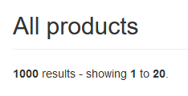
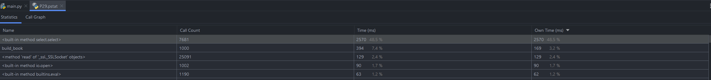
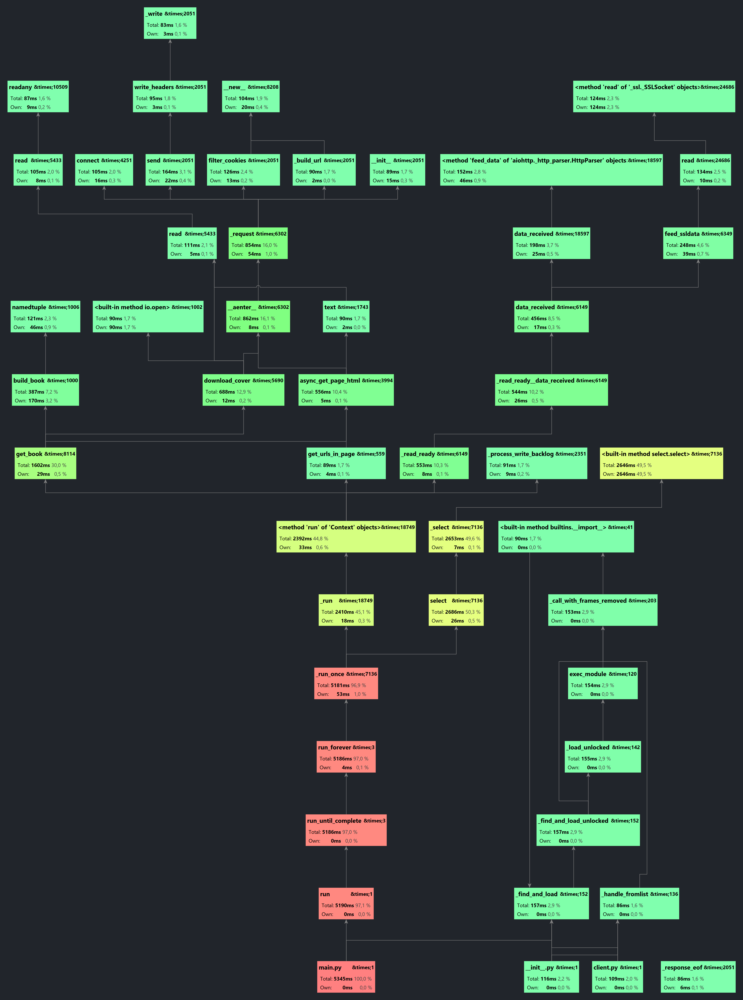

#  OpenClassrooms - Python Developer certification program : Project #2 : build a web scraper

## <a id='top'>Summary</a>

1. [Project goals](#1)
2. [Skills trained](#2)
3. [Solving approach](#3)  
__ 3.1 [Version 1](#3.1)  
__ 3.2 [Version 2](#3.2)  
__ 3.3 [Version 3](#3.3)
4. [Codebase structure](#4)
5. [Performance breakdown](#5)
6. [Upcoming improvements](#6)


## <a id="1">Project goals</a>
- Write a first Python script
- Scrape https://books.toscrape.com/
- Extract each book details: title, upc, ex-vat price, price, stock, 
  description,  category, rating, cover url, cover id
- Download books covers
- Export a CSV file with every book details

## <a id="2">Skills trained</a>
- Make HTTP requests
- Parse HTML content
- Write files to a local directory

## <a id='3'>Solving approach</a>

The final script is the 3rd iteration of the project.

### <a id='3.1'>3.1 - Version 1</a>

#### :clock1: Execution time

18min

#### :file_folder: Packages
- **requests**
- **Beautiful Soup**

#### :memo: Results
This first version was working but was super slow.

### <a id='3.2'>3.2 - Version 2</a>

#### :clock1: Execution time
21s

#### :file_folder: Packages

- **requests** 
- **Selectolax**
- **concurrent.futures** ThreadPoolExecutor

#### :bulb: Ideas

- Run concurrent GET requests by assigning tasks to a pool of _ThreadPoolExecutors_. 
- Replace _Beautiful Soup_ by _Selectolax_ parser (based on the C parser _Modest_), to try to speed up the HTML parsing.

#### :memo: Results 
- CPU spiking to 70% of its capacity during the execution of the script.  
- The most time-consuming part is neither the HTML parsing nor the CSV writing: it's the HTTP request ~1s response time * 1050+ requests.  
- Multithreading enables to start batches of concurrent blocking functions and gather the results, but is limited to the number of threads my CPU could provide.

### <a id='3.3'>3.3 - Version 3</a>

#### :clock1: Execution time
4.37s - 5.8s

#### :file_folder: Packages
- **asyncio**
- **aiohttp + chardet**
- **Selectolax**
- **cProfile**

#### :bulb: Ideas

- Remove all multithreading related code, and make asynchronous requests.
- Profile the script in order to avoid trying to infer what makes it slow.

#### :memo: Results
The profiler reported that a method from the _charset-normalizer_ package (_aiohttp_ dependency) was executed for a total of 11 out of the 16s to run (68% of the total execution time).
I replaced it with chardet, after switching virtual environments to run a Python 3.9 version (chardet not yet compatible with Python >= 3.10).

However, because of _Windows Event Loop Policy_ causing errors with asyncio default loop (see [GitHub issue here](https://github.com/encode/httpx/issues/914)) I had to add a condition to change asyncio's event loop policy if the script was to be run on a Windows OS.

Setting `asyncio.set_event_loop_policy(WindowsSelectorEventLoopPolicy())` takes 2.1s (62% of the total execution time)
Therefore, if this is fixed in the future, my script could maybe run in 2.3s. 

### <a id='4'>4. - Code Structure</a>

In order to scrape all books details and download covers, my script had to: 

1. Navigate through every catalogue page of books.toscrape.com and gather books urls
2. Request the HTML content for every book page and parse it to find the data needed
3. Request the books covers (cover url in the book data from step 2)
4. Save all the covers into a local directory
5. Create a CSV file with all the books details in a local directory

As of asynchronous version 4 of the script, I tried to request as little content as possible, and to chain functions to get book details/download covers to be executed in a single coroutine.

#### Step 1
Instead of requesting/parsing each page of the catalogue, I looked for the books count in the landing page.
  
Since every catalogue pages share the same url structure : `https://books.toscrape.com/catalogue/page-{page_num}.html`
I just had to divide 1000 books / 20 to build a list of 50 urls from https://books.toscrape.com/catalogue/page-1.html to https://books.toscrape.com/catalogue/page-50.html 
This way, I could create a batch of concurrent requests instead of sequentially parsing the catalogue pages.

To get the 20 books urls per catalogue page, I built a list of 50 async tasks (1 task for each catalogue page)
That async task had to :
- Make a GET request to the catalogue page url
- Parse the HTML to extract the 20 books urls

Finally, I awaited `asyncio.gather(*tasks)` to pack all the 20 * 50 books urls in a list

#### Step 2, 3, 4

At that step I had a list of every book url to work with.

For each book, i designed an async task to :
- Make a GET request to the book page url
- Parse the HTML to extract the book details
- Store the book details in a namedtuple with the following structure

```python
Book = namedtuple(
        "Book",
        "url upc title itp etp stock description "
        "category rating cover_url cover_id",
    )
```

- Make a GET request to the `cover_url`
- Write it to the `exports/covers/` local directory
- Return the Book namedtuple

After all the tasks were executed, asyncio gathered all the books in a list.

#### Step 5

At this step I had downloaded every book cover and had a list of books to work with.  
I used the _**csv**_ library to bulk write the content of the list to a file in the `exports/csv/` directory.  
I tried Pandas to write a gzipped CSV file but the performance gain was too slight for only 1000 rows, so I stuck with the default csv library.

## <a id='5'>Performance breakdown</a>

As we can see in Fig. 1, the functions that uses most of the execution / CPU time are:

- 48.5% : `<built in method select.select>` : from asyncio to use Windows Event Loop, for 2570ms of the total execution time. This is the yellow blocks sequence in Fig. 2
- 7.4% `build_book()` : the function that parses the HTML and returns a tuple with the book details, for 400ms of the total execution time but only half in CPU time, maybe because it is waiting at some point. (Green block to the left of fig 2.)


**Fig. 1 - _cProfile_ Statistics**



**Fig. 2 - _cProfile_ Graph**


## <a id='6'>Upcoming improvements</a>

- [ ] Error handling
- [ ] Unit tests

[:arrow_up: Back to top](#top)

